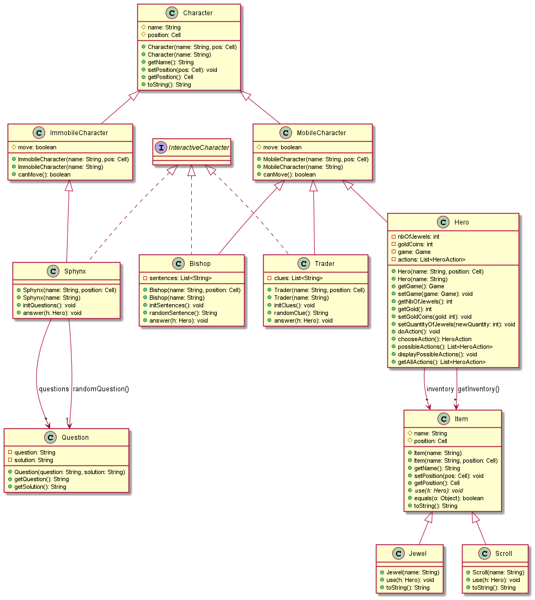

# l2s4-projet-2022

# Equipe

- Chaïma BOUDEHANE
- Wissal FATY
- Fatou NDAO
- Wagnan SORO

# Sujet

[Le sujet 2022](https://www.fil.univ-lille1.fr/portail/index.php?dipl=L&sem=S4&ue=Projet&label=Documents)


# Rendu final   

# Instructions  

## Récupérer le projet  

```bash
git clone git@github.com:ChaimaBdh/maze-game_java.git 
```

*se placer dans le répertoire*  

```bash
cd maze-game_java
```

## Génération et consultation de la documentation  

*générer* :

```bash
.../projet> make doc
```  

*consulter* :  

Ouvrir le fichier **index.html** situé dans le dossier **/docs** dans le navigateur.  


## Compilation des sources et tests du projet  

```bash
.../projet> make cls
```  

## Exécution des tests

```bash
.../projet> java -jar test4poo.jar nomDuPackage.NomDeClasseTest
```  

## Production du jar exécutable (implique la compilation du code source et des tests)

```bash
.../projet> make jeu.jar
```

## Exécution du jeu  

**Pour l'algorithme de l'arbre binaire :**  

```sh
.../projet> java -jar jar/jeu.jar 1
```  

**Pour l'algorithme de sidewinder :**  

```sh
.../projet> java -jar jar/jeu.jar 2
```  

## Autres indications  

* La documentation et la compilation se génèrent correctement. Tous les tests sont passés avec succès, et le jeu fonctionne normalement : il faut arriver à la position (8,3) et avoir 5 pièces d'or pour réussir la quête.

* Nous avons représenté les objets par le symbole `◊` pour ajouter un certain dynamisme au jeu. Les personnages eux ne sont pas visibles mais bel et bien présents.

* Le répertoire `img` contient les premiers diagrammes uml effectués depuis le début du projet et les images d'affichage du plateau.

* Il existe une deuxième version (GameMain2), dans laquelle nous pouvons choisir les dimensions du plateau ainsi que l'algorithme sans avoir à passer un chiffre en argument. De plus, la cellule correspondant à la quête est à chaque fois aléatoire.
Voici les commandes à effectuer :      


*production du jar :*  
```bash
.../projet> make jeu-v2.jar  
```  

*exécution du jeu*  
```bash
.../projet> make game
```

## Nettoyer les fichiers  

```bash
.../projet> make clean
```  

# Livrables

## Livrable 1

```
Commencement sur la cellule(0,0)  
Vérification des bords de la grille :  
 TANT QUE nous ne sommes pas dans la dernière cellule en bas à droite :  
 |  SI position de la cellule est sur le bord du bas :   
 |   |  
 |   destruction du mur Est   
 |    
 |  SI position de la cellule est sur le bord droit :  
 |   |   
 |   destruction du mur Sud    
 |    
 |  SINON (dans les autres cases de la grille) :  
 |   |  
 |   choix destruction du mur Est ou Sud  
 |  
 Interdiction de détruire (la dernière case en bas à droite)
```  
*Pseudo code de l'arbre binaire*  

```  
Commencement à la ligne du haut, cellule(0,0).
Parcours de la grille ligne par ligne.
Choix de destruction du mur EST (aléatoire) :
  SI destruction du mur EST :
   |   |
   |   mur EST détruit, cellule ajoutée à la liste (= passage horizontal)
   |
   |
  SINON : destruction du mur SUD (aléatoire) selon le passage horizontal existant (parcours de la liste de cellules)
```  
*Pseudo code de Sidewinder*  

### Exemples d'affichage du plateau  

  
*Affichage du plateau (arbre binaire)*  

  
*Affichage du plateau (sidewinder)*    

### Atteinte des objectifs

  
*modélisation du plateau : diagramme UML*        

### Difficultés restant à résoudre

## Livrable 2

### Atteinte des objectifs

  

*modélisation des personnages et des objets : diagramme uml*  

### Difficultés restant à résoudre

## Livrable 3

### Atteinte des objectifs

  

*modélisation des actions : diagramme uml*      

### Difficultés restant à résoudre

## Livrable 4  

```  
Afficher position initiale du héro sur le plateau (débute à la cellule (0,0))  
TANT QUE la quête n'est pas finie :
|      |
|     Le hero effectue une action à chaque tour  
|              
|
SINON:
    fin du jeu : afficher phrase de fin, le joueur a réussi la quête  
```    
*pseudo-code de la boucle du jeu (méthode play)*  

### Atteinte des objectifs

  

*modélisation complète du projet*  

### Difficultés restant à résoudre

# Journal de bord

## Semaine 1

Nous avons commencé à discuter des différents algorithmes que nous avions à disposition.
Choix de l'algorithme : nous avons décidé d'utiliser l'algorithme de l'arbre binaire. Pour la modélisation du labyrinthe, celui-ci sera construit à partir d'un tableau 2 dimensions pour lequel chaque case contiendra une direction (Nord, Est, Sud, Ouest).
Le premier algorithme que nous avons choisi consiste dans une grille générée (le tableau 2 dimensions), de détruire uniquement les murs Est et Sud de façon aléatoire.

**NB : lorsque l'on détruit le "mur" Est d'une case, il s'agit de la destruction du mur Ouest de la case voisine. De même pour la destruction de la case du mur Sud, il s'agit de détruire en même temps le mur Nord de la case voisine.**

L'algorithme étant choisi, nous réfléchissons quant à l'implémentation de celui-ci. Nous pensons à une fonction destroyWall qui permettra de détruire un mur selon les coordonnées qui seront passées en paramètre (ainsi que le type de mur qui sera détruit).
La difficulté ici est de faire en sorte à ce que la destruction du mur d'une cellule engendrera  également la destruction du mur de la cellule voisine.
Ex :
si on veut détruire le mur Est de la cellule de coordonnées (1,1), le mur Ouest de la cellule de coordonnées (2,1) devra être détruit aussi.

Cependant, la modélisation des murs faite pour l'instant n'est pas encore sûre et risque de changer par la suite.

## Semaine 2

Pour le second algorithme à implémenter, nous avons choisis celui de Sidewinder. Etant similaire à l'agorithme de l'arbre binaire, il permet de générer un labyrinthe une ligne à la fois.  
Pour chaque cellule d'une ligne, on décide de façon aléatoire de détruire le mur Est ou pas.  
On va détruire le mur Est pour une cellule choisie aléatoirement. Au fur et à mesure des destructions des murs, nous verrons un passage horizontal se former. Si la destruction du mur Est n'est pas observée pour une cellule, ça sera le mur Sud qui sera détruit.

**NB : Il faut bien évidemment faire attention aux cellules en fin de grille pour lesquelles le mur Est ne pourra être détruit.**   

Nous avons également commencé à coder les tests des classes Cell et Board. Nous n'avons pas encore fini d'implémenter l'algorithme de Sidewinder, des corrections sont à faire.

## Semaine 3

Nous avons créé une interface MazeGenerator qui contient une méthode generateMaze(Board b). Cette interface verra ainsi deux classes qui l'implémenteront (Sidewinder et BinaryTree dans le package algo). Grâce aux explications du professeur en séance de projet, nous avons compris que le choix d'une interface était le plus logique en vue de la conception du plateau.
Il restera également à élaborer une méthode dans la classe Board qui permettra de prendre en paramètre un algorithme qui sera de type MazeGenerator, et qui servira à initialiser depuis cette classe le type de labyrinthe que le joueur souhaitera.  
De plus l'algorithme Sidewinder est à ce jour, toujours en cours d'implémentation...  

## Semaine 4

Nous avons fini d'implémenter l'algorithme de sidewinder. Nous avons également codé l'interface MazeGenerator, ainsi qu'une méthode selectMaze (dans la classe Board) qui prend en paramètre un objet de type MazeGenerator. Cette méthode permet de sélectionner un algorithme de génération de labyrinthe. Ce qui est pratique si nous voulons ajouter par la suite différents types d'algorithmes dans le projet. Nous avons complété et finalisé l'UML représentant le plateau du jeu (voir livrable 1).  
La classe BoardMain (étant temporaire puisque ce code devra figurer dans une classe GameMain) peut être compilée et exécutée : elle permet d'afficher le plateau en choisissant au préalable, en utilisant le terminal de commandes, la taille du plateau ainsi que l'algorithme que l'on souhaite.  
La documentation et la compilation des classes présentes peuvent être générées sans aucun problème (voir commandes dans le livrable 1).  

## Semaine 5

Nous arrivons à l'épisode de la modélisation des personnages et objets. Nous avons pour idée de créer deux classes abstraites : Character et Item. En effet, ces classes seront abstraites car elles serviront de base pour d'autres classes dérivées (qui hériteront de celles-ci). Les différents types de personnage (héro, marchand, fou et sphynx) hériteront de la classe mère Character.
Les classes de différents objets hériteront de la classe Item.  
Ces classes dérivées seront disposées dans deux sous-paquetages respectifs *characters* et *items* afin de les différencier.  
Nous commençons à établir le diagramme UML de toutes ces classes.

## Semaine 6

Nous avons avancé dans la modélisation du diagramme UML. Nous avons créé deux classes abstraites MobileCharacter et ImmobileCharacter qui héritent de la classe Character (que nous avons disposées dans deux sous-paquetages avec leurs classes filles) afin de spécifier quels personnages du jeu pourront se déplacer ou non.
Nous avons également bien avancé dans la modélisation du héro. Cependant, quelques questions subsistent telles que :  
* Comment le héro va-t-il interroger les personnages autour de lui ?  
* Comment va-t-il échanger des objets avec ces derniers ?  
* Comment modéliser concrètement l'utilisation des objets ? (leur méthode use(), que va t-elle contenir ?).
* Comment modéliser la quête qui demeure inconnue du héro, qui peut être différente à chaque nouveau lancement du jeu, et qui s'avère être dans une cellule inconnue (peut-être aléatoire ?).

## Semaine 7

Nous avons débuté la modélisation de la quête. Nous avons décidé que la quête (non connue du héro et donc du joueur) sera l'atteinte d'une case spécifique dans le plateau. Nous avons ainsi créé une classe Quest dans laquelle son constructeur est défini par le plateau du jeu et par une méthode initQuest. Cette méthode initQuest a pour but d'initialiser la quête à chaque construction de cet objet.
Cette méthode renvoie vers la méthode getRandomCell. Cette dernière renvoie, comme son nom l'indique, une cellule aléatoire du plateau (conforme aux dimensions du plateau). Donc à l'avenir, lorsque le joueur atteindra une case correspondant à la cellule aléatoire renvoyée par la méthode getRandomCell, le jeu se terminera car le joueur aura réussi la quête.

## Semaine 8

Nous avons ajouté des personnages et des objets dans le GameMain à l'aide des fonctions addCharacter() et addItem() de la classe Game. Ces deux méthodes ajoutent respectivement un personnage et un objet dans une cellule aléatoire.
Nous avons également effectué quelques modifications dans les objets tels que la suppression du paramètre de type Hero jugé non nécessaire car à la création de l'objet, le héro ne possède pas tout de suite l'objet.
Mais aussi dans la classe Cell ou nous avons ajouté les méthodes permettant d'associer un personnage/objet à une cellule, et de récupérer ces derniers.
La génération de la documentation ainsi que la compilation du code source et des tests se font normalement.
Tous les tests fonctionnent excepté une méthode de test de la classe QuestTest (nous ne comprenons pas l'erreur renvoyée).
Quand on exécute GameMain, on observe la position (à chaque fois aléatoire à chaque exécution) des objets et personnages que nous avons créé. Evidemment, c'est temporaire car à la fin de la conception du jeu, on ne connaîtra pas la position des objets et personnages (sauf celle du héro).

## Semaine 9

Nous avons commencé à penser à la boucle du jeu, voir le début du pseudo-code (très bref) dans le livrable 3.  
Pour la modélisation des actions, nous avons décidé de définir une interface HeroAction qui déclare une méthode do().  Nous pensons à créer différentes classes d'action telles que PickUp (ramasser), LookAround (regarder autour), UseObject (utiliser un objet) ... etc.
Ces classes implémenteront toutes l'interface HeroAction, et auront toutes une méthode do() différente selon le type d'action. Ainsi, cette méthode do() correspondera directement à la définition de l'action.
Nous pensons également à définir une méthode doAction() dans la classe Héro, qui prend en paramètre une action de type HeroAction (l'interface) et qui depuis cette instance applique la méthode do().  
De même, nous voulons créer une méthode answer() dans les classes de personnage qui répondent au héro (Sphynx, Trader et Bishop) dès lors que celui-ci intéragit avec eux.  
Dans la définition de la méthode interact(Character c), qui sera contenue dans la classe Interact (implémentant HeroAction), on aura : c.answer(). Selon le type de personnage, la réponse donnée au héro sera différente.


## Semaine 10

Nous avons continué la modélisation de ce qui a été dit la semaine précédente, en rajoutant de nouveaux éléments dans la classe Hero. Nous avons décomposé les choses de la manière suivante :  
* une méthode qui retourne la liste des actions possibles.
* une méthode qui affiche les actions disponibles.
* une méthode qui permet de choisir l'action
* une méthode principale doAction() qui exécute l'action selon le choix de celle-ci.  

**NB : nous avons rebaptisé la méthode do() par la méthode apply() (par soucis de compilation)**  

Nous avons bien avancé en ce qui concerne les méthodes d'action de la classe héro, puis celles de PickUp.   

## Semaine 11

Nous avons fini la modélisation des actions. Toutes les classes d'action sont complétées. De plus, pour l'action d'interaction, nous avons créé une interface implémentée par tous les personnages (sauf le héro). Cette interface contient la méthode `answer` qui consiste à la réponse des personnages au héro lorsque celui-ci interagit avec eux.  
Nous avons créé une classe Question qui prend en paramètre de construction une question et une réponse (String).  
Cette classe est utile pour le personnage du sphynx. Elle permettra de créer une liste à sa création (du sphynx) contenant plusieurs questions/réponses prédéfinies. Lors de l'interaction avec ce sphynx, le héro aura à répondre à une question aléatoire de cette liste.
De même pour le fou, nous avons créé une liste de phrases prédéfinies qui seront aléatoires également. Pour le marchand, nous allons le faire aussi pour les différents indices qu'il donnera au héro.
Au fur et à mesure, on ajoutera plusieurs questions/réponses, phrases et indices pour tous ces personnages, afin de permettre la diversité du jeu.
Nous attaquons désormais la partie finale de la boucle du jeu.

## Semaine 12

Nous avons implémenté le code de la méthode `play` qui s'avère être très simple puisque la méthode `doAction` gère tout ce qui touche les actions du héro (choix de l'action et application de celle-ci).   
Nous avons ajouté une nouvelle action Help dans le paquetage `maze.actions`, qui consiste à afficher toutes les actions possibles pour le héro.
Nous sommes parvenues à afficher un menu qui permet de guider l'utilisateur qui jouera au jeu. Cependant, nous rencontront des soucis avec certaines actions du héro.
Nous y remédions...  

**NOTE : nous touchons au but ...**  
